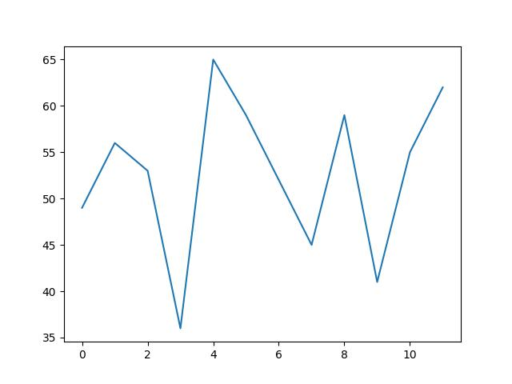

Построим самый простой график.

В самом начале программы записана команда

```
import matplotlib.pyplot as plt
```

Здесь происходит импортирование не всей библиотеки `matplotlib`, а только одного модуля из нее — `pyplot`. Для простоты мы присваиваем ему сокращение `plt`.

После команды `year_2021 = ...` запишите команды:
```
plt.plot(year_2021)
plt.savefig('my_plot.jpg')
```

После запуска программы с помощью консоли в дереве файлов должен появиться файл `my_plot.jpg`. На него можно тыкнуть и посмотреть. Чтобы обновить картинку нужно будет через консоль запускать программу, в которой есть команда 
```
plt.savefig(name)
```

Ориентир:
