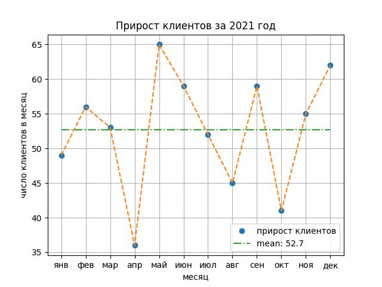

Когда на графике появляется больше одного объекта, `matplotlib` сам назначает им разные цвета. Помимо этого, для лучшей различимости разных объектов можно изменять их стиль.

Вместо команды:

```python
plt.plot(year_2021, label='прирост клиентов')
```

Нарисуем данные два раза: один раз точками, другой — пунктирной линией:

```python
plt.plot(year_2021, 'o', label='прирост клиентов')
plt.plot(year_2021, linestyle='--')
```

`'o'` без указания аргумента говорит матплотлибу, что данные нужно отрисовать точками. `linestyle='--'` — пунктирной линией.

Также добавьте в команду 
```
plt.plot(mean * np.ones(len(year_2021)))
``` 
аргумент 
```
linestyle='-.'
```

Это сделает линию среднего более отличимой от линии данных.


Для обновления графика программу нужно запустить.


Ориентир:
