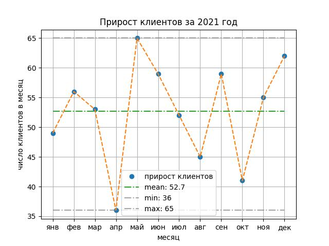

Далее необходимо найти минимум и максимум, а затем нанести на график их линии.

После расчета `mean` добавьте команды

```python
year_min  = year_2021.min()
year_max  = year_2021.max()
```

После команды `plt.plot(mean, ...)` добавьте команду

```python
plt.plot(np.ones(len(year_2021)) * year_min,
       linestyle='-.',
       color='C7',
       alpha=0.7,
       label=f'min: {year_min}')
```

Это позволит отрисовать линию `year_min`.

Аргумент `color='C7'` задает цвет из стандартной палитры. Всего в ней 10 цветов: `C0, C1, C2, ..., C9`.

Аргумент `alpha=0.7` задает прозрачность от 0 — полная прозрачность до 1 — полная непрозрачность.

Аргумент `f'min: {year_min}'` задает имя для легенды.

Аналогично отрисуйте линию `year_max`.


Для обновления графика программу нужно запустить.


Ориентир:
