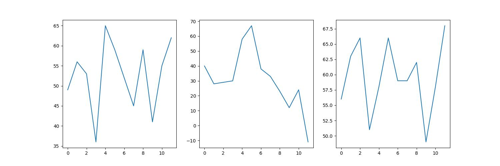

Перед циклом `for` вставьте блок

```python
plt.figure(figsize=(15, 5))
```

Числа `15` и `5` задают размер полотна, и графики равномерно размещаются на нем.


Полученный график будет храниться в файле `subplot.jpg`. Для обновления графика программу нужно запустить.


Если картинку плохо видно, на нее можно тыкнуть правой кнопкой мыши и открыть в новой вкладке. А если вы работаете с ноутбука, то просто приблизить пальцами по тачпаду. 

Таким образом мы получили три графика, показывающие данные за три года на одном полотне. 
Далее добавим подписи.


Ориентир:

