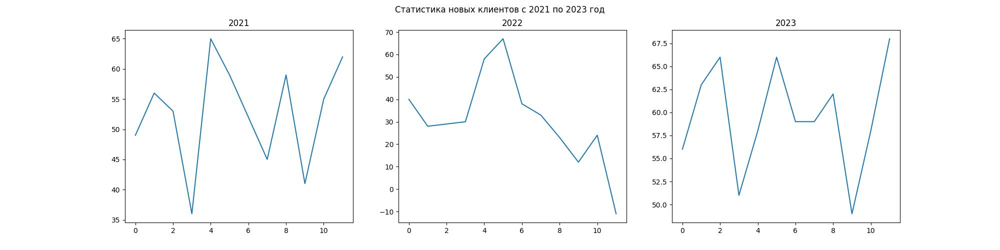

Добавим названия графиков.

После `plt.figure` вставьте команду

```python
plt.suptitle(f'Статистика новых клиентов с 2021 по 2023 год')
```

Это будет название для всего полотна.

После команды `plt.plot(year_data)` добавьте команду

```python
plt.title(str(year))
```

Таким образом, у каждого графика будет подпись в виде соответствующего года, взятого из итератора.


Полученный график будет храниться в файле `subplot.jpg`. Для обновления графика программу нужно запустить.


Ориентир:
