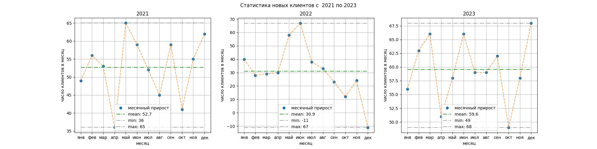

Наконец пора собрать все в кучу. 
Вернитесь к задаче 12, скопируйте из нее код, начиная с расчета `mean` до `plt.legend()`, и вставьте в цикл. `plt.savefig(...)` вставлять в цикл не нужно, эта команда должна быть за циклом.

Не забудьте сделать табуляцию для корректной работы цикла. Для этого можно выделить весь вставленный текст и нажать `tab` или `shift+tab` для отмены табуляции.

 Так же название `year_2021` измените на `year_data`.

 Еще удалите лишнюю отрисовку данных прироста клиентов. Иначе на легенде будут лишние элементы.

 Поля `label` тоже нужно будет поменять соответственно годам как задании 15. 

Полученный график будет храниться в файле `subplot.jpg`. Для обновления графика программу нужно запустить.

Ориентир:
