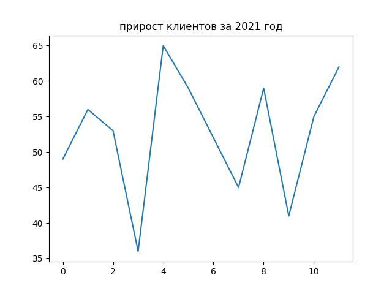

Пока не очень красиво. Займемся оформлением!

В среде аналитиков есть несколько правил хорошего тона, а в научной среде и вовсе *требований*. Они появились не на пустом месте. Вам, как человеку, который строит график, и так понятно, что на нем изображено. А вот зрителю ничего о вашей картинке неизвестно, поэтому нужно ввести зрителя в суть дела.


Правило 1: название графика.

После команды `plt.plot` запишите команду 
```
plt.title('прирост клиентов за 2021 год')
```

После запуска программы в консоли посмотрите на изменения каритинки в файле `my_plot.jpg`. Должно появится название сверху графика.


Ориентир:


