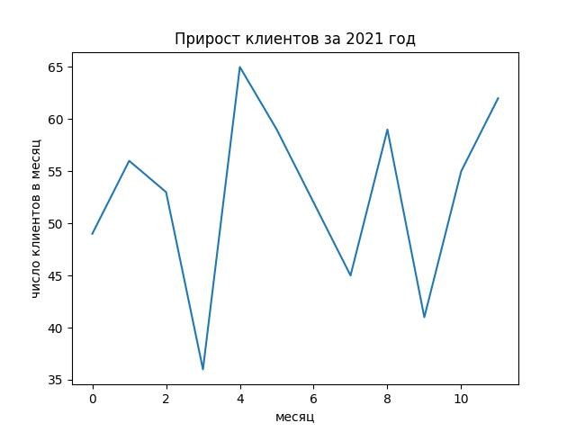

Правило 2: подписи осей.


По названию графика уже можно предположить, что по вертикали число клиентов, а вот по горизонтали читатель должен догадываться, что речь о месяцах. Это неправильно, график должен быть настолько понятным, насколько это возможно.

После команды `plt.plot` допишите:
```python
plt.xlabel('месяц')
plt.ylabel('число клиентов в месяц')
```

После запуска программы в консоли посмотрите на изменения в файле `my_plot.jpg`.


Ориентир:
