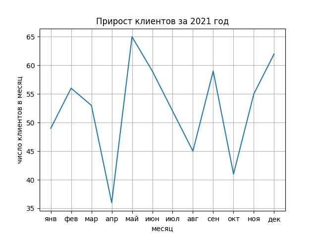

Правило 3: сетка.

Графики намного проще интерпретировать, если нанесена сетка. Допишите в конце программы команду
```
plt.grid()
```

Затем запустите программу через консоль и посмотрите как изменилась картинка.


Ориентир:
