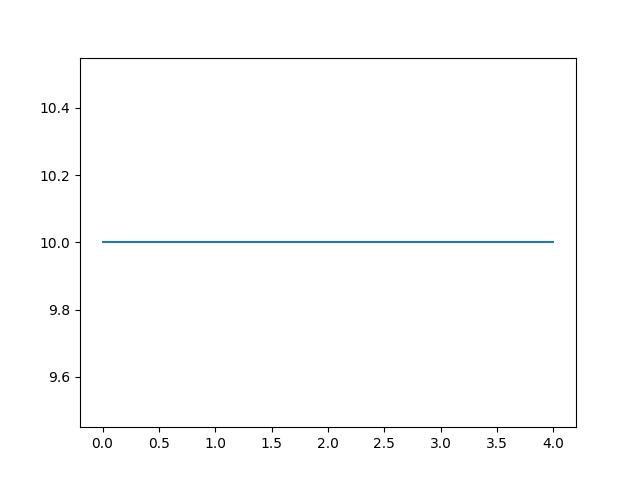

Запишите команду

```
plt.plot(10 * np.ones(5))
```

Получится линия от 0 до 5 на уровне 10 (по высоте). Там на самом деле это все еще 5 точек, просто они соединены — и получается прямая.

Этот код пригодится для того, чтобы нарисовать линию среднего значения, а пока просто посмотрите, что получиться в файле 'line_plot.jpg'.


Для обновления графика программу нужно запустить.


Ориентир:
