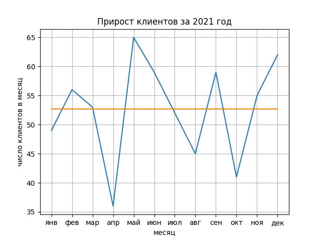

После команды `plt.plot(year_2021)` впишите команду

```
plt.plot(mean * np.ones(len(year_2021)))
```

Таким образом, получится линия из 12 точек (потому что длина `year_2021` равна 12), находящаяся на уровне среднего значения массива. На графике она отрисуется оранжевым цветом. 

График сохраниться в файле `my_plot.jpg`.
Для обновления графика программу нужно запустить.


Ориентир:
