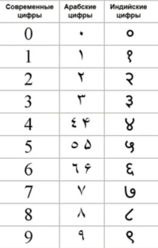

Что касается чисел, то о числе можно думать как о забавном наборе каракуль чтобы описать какое-то количество или величину. Идея не нова, ей много веков.

В математике у нас примерно 5 базовых типов чисел, хотя на самом деле их намного (НАМНОГО) больше. В программировании все проще, базовых типов всего 2.